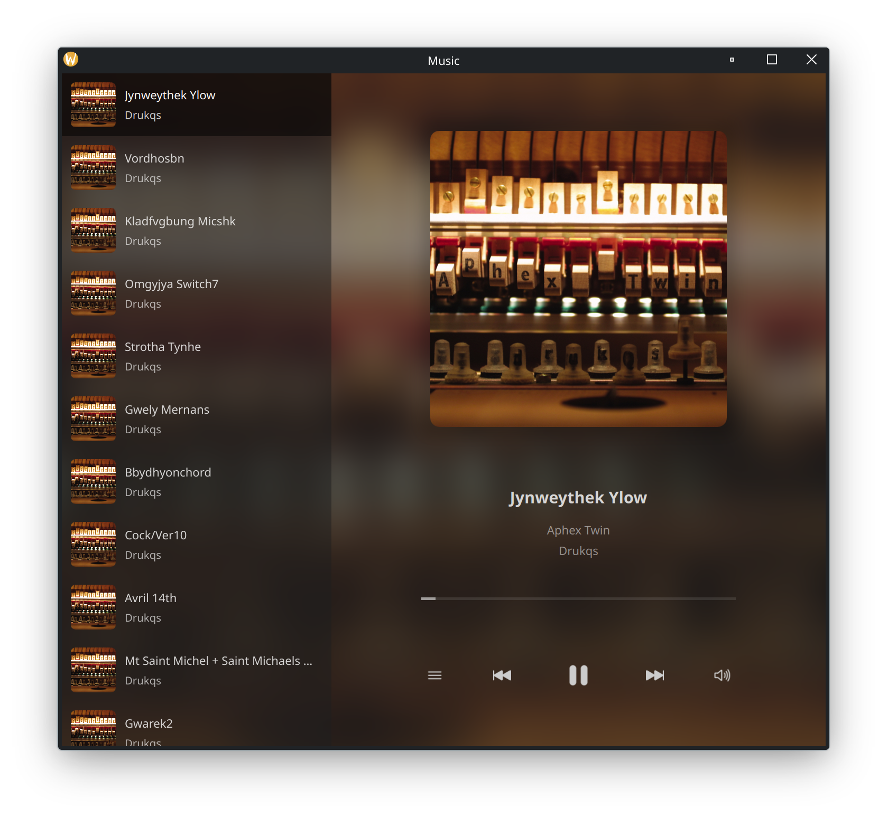

# Music



## Dependencies

### Arch

```console
sudo pacman -Sy gcc cmake qt6-base qt6-multimedia qt6-declarative qt6-5compat taglib
```

### Fedora

```console
sudo dnf install cmake qt6-qtbase-devel qt6-qtmultimedia-devel qt6-qtdeclarative-devel qt6-qt5compat-devel taglib-devel
```

### Debian

```console
sudo apt install cmake qt6-base-dev qt6-multimedia-dev qt6-declarative-dev qt6-5compat-dev libtag1-dev
```

## Build

```console
mkdir build && cd build
cmake ..
make
```